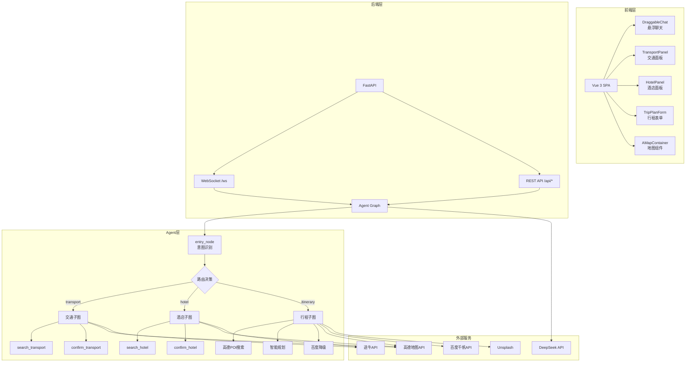

# 🌍 智能旅行规划助手 - Travel Agent

基于 **LangGraph + FastAPI + Vue 3** 构建的智能旅行规划系统，支持对话式交互和表单输入双模式，集成高德地图实现可视化行程规划。

## ✨ 核心特性

### 🎯 双模式交互
- **表单模式**：结构化输入，适合明确规划需求的用户
- **对话模式**：自然语言交互，AI智能引导收集信息

### 🤖 Agent智能体架构
基于LangGraph构建的三层子图架构：
- **交通Agent**：智能查询和预订高铁/机票，支持去程+返程
- **酒店Agent**：根据偏好推荐并确认酒店预订
- **行程Agent**：自动规划每日行程，景点/餐饮/路线一体化

### 🗺️ 地图可视化
- 集成**高德地图JS API**，支持地图展示和POI搜索
- 结构化行程数据可视化呈现
- 智能降级策略（高德异常→百度文本模式）

### 💬 WebSocket实时通信
- 悬浮可拖拽聊天窗口
- 支持拖拽调整大小、最小化/展开
- 实时状态同步（交通/酒店/行程状态更新）

## 🏗️ 技术架构

### 前端技术栈
- **Vue 3** + **TypeScript** + **Vite**
- **Ant Design Vue 4.x** - UI组件库
- **高德地图 JS API** - 地图服务
- **Axios** - HTTP客户端
- **Day.js** - 日期处理

### 后端技术栈
- **FastAPI** - Web框架
- **LangGraph** - Agent编排框架
- **LangChain** - LLM集成
- **Python 3.11** - 运行环境
- **Pydantic** - 数据验证

### 外部API集成
- **DeepSeek API** - 大语言模型
- **高德地图 API** - 地理信息、POI搜索、路线规划
- **百度千帆 API** - 搜索服务（降级方案）
- **途牛 API** - 旅行数据
- **Unsplash API** - 目的地图片

## 📁 项目结构
```

traveler_agent_build/
├── 📁 backend/                 # FastAPI后端
│   ├── 📁 app/
│   │   ├── server.py          # FastAPI主入口，WebSocket处理
│   │   ├── run_travel_planner.py  # 启动脚本
│   │   ├── 📁 api/            # API路由层
│   │   │   ├── routes.py      # 行程规划API（表单/对话模式）
│   │   │   ├── poi_routes.py  # POI搜索接口
│   │   │   ├── map_routes.py  # 地图服务接口
│   │   │   ├── llm.py         # LLM配置
│   │   │   └── tuniu_cli.py   # 途牛CLI集成
│   │   ├── 📁 agents/         # Agent子图实现
│   │   │   ├── graph.py       # 主图编排（入口路由）
│   │   │   ├── agents.py      # 交通/酒店/行程子图实现
│   │   │   ├── itinerary_planner.py  # 行程规划逻辑
│   │   │   └── helpers.py     # 辅助函数
│   │   ├── 📁 models/         # 数据模型
│   │   │   ├── schemas.py     # Pydantic模型定义
│   │   │   └── state_definitions.py  # Agent状态定义
│   │   ├── 📁 services/       # 业务服务层
│   │   │   ├── amap_service.py    # 高德地图服务
│   │   │   └── unsplash_service.py # 图片服务
│   │   └── 📁 tools/          # 工具函数
│   │       ├── tools.py       # 通用工具（搜索/确认）
│   │       └── amap_tools.py  # 高德MCP工具
│   ├── Dockerfile             # 后端Dockerfile
│   └── requirements.txt       # Python依赖
│
├── 📁 frontend/               # Vue前端
│   ├── 📁 src/
│   │   ├── 📁 views/          # 页面视图
│   │   │   └── MainView.vue   # 主页面（集成布局）
│   │   ├── 📁 components/     # 组件
│   │   │   ├── DraggableChat.vue      # 悬浮聊天框
│   │   │   ├── TransportPanel.vue     # 交通选择面板
│   │   │   ├── HotelPanel.vue         # 酒店选择面板
│   │   │   ├── TripPlanFormEmbedded.vue   # 嵌入式行程表单
│   │   │   ├── TripPlanResultEmbedded.vue # 嵌入式结果展示
│   │   │   └── AMapContainer.vue      # 高德地图容器
│   │   ├── 📁 router/         # Vue Router
│   │   ├── 📁 services/       # API服务
│   │   └── 📁 types/          # TypeScript类型
│   ├── Dockerfile             # 前端Dockerfile（多阶段构建）
│   ├── nginx.conf             # Nginx配置
│   └── package.json           # Node依赖
│
├── docker-compose.yml         # Docker编排配置
├── .dockerignore             # Docker忽略文件
├── .env                      # 环境变量（需自行配置）
└── README.md                 # 项目说明
```

## 🚀 快速开始

### 方式一：Docker部署（推荐）

#### 1. 环境准备
- 安装 [Docker](https://docs.docker.com/get-docker/)
- 安装 [Docker Compose](https://docs.docker.com/compose/install/)

#### 2. 配置环境变量
创建根目录 `.env` 文件：

```bash
# LLM API配置
DEEPSEEK_API_KEY=your_deepseek_api_key
DEEPSEEK_API_BASE_URL=https://api.deepseek.com/v1

# 途牛API配置
TUNIU_API_KEY=your_tuniu_api_key
TUNIU_API_BASE_URL=https://api.tuniu.com/api

# 百度API配置
BAIDU_SEARCH_URL=your_baidu_search_url
BAIDU_API_KEY=your_baidu_api_key

# Unsplash图片API
UNSPLASH_ACCESS_KEY=your_unsplash_access_key
UNSPLASH_SECRET_KEY=your_unsplash_secret_key

# 高德地图前端密钥（前端使用）
VITE_AMAP_WEB_KEY=your_amap_web_key
VITE_AMAP_WEB_JS_KEY=your_amap_js_key
```

#### 3. 启动服务

```bash
# 构建并启动所有服务
docker-compose up -d --build

# 查看日志
docker-compose logs -f

# 停止服务
docker-compose down
```

#### 4. 访问应用
- **前端界面**: http://localhost
- **后端API文档**: http://localhost:8000/docs
- **WebSocket端点**: ws://localhost/ws

---

### 方式二：本地开发环境

#### 后端启动

```bash
# 1. 创建Python虚拟环境
cd backend
python -m venv venv

# 2. 激活环境（Windows）
venv\Scripts\activate
# 或（Linux/Mac）
source venv/bin/activate

# 3. 安装依赖
pip install -r requirements.txt -r requirements_.txt

# 4. 启动服务
cd app
python run_travel_planner.py
# 或使用uvicorn
uvicorn server:app --reload --host 0.0.0.0 --port 8000
```

后端服务运行在: http://localhost:8000

#### 前端启动

```bash
# 1. 进入前端目录
cd frontend

# 2. 安装依赖
npm install

# 3. 配置环境变量
# 编辑 frontend/.env 文件
VITE_API_BASE_URL=http://localhost:8000
VITE_AMAP_WEB_KEY=your_amap_key
VITE_AMAP_WEB_JS_KEY=your_amap_js_key

# 4. 启动开发服务器
npm run dev
```

前端开发服务器运行在: http://localhost:5173

## 📋 功能使用指南

### 表单模式规划

1. 在主界面右侧点击「开始规划」
2. 填写目的地、日期、偏好等信息
3. 提交表单，系统将自动：
   - 搜索目的地天气和景点
   - 规划每日详细行程
   - 在高德地图上可视化展示路线

### 对话模式交互

1. 点击右下角悬浮的「💬 智能助手」聊天框
2. 输入自然语言需求，如：
   - "帮我规划一个北京3日游"
   - "我想订从上海到杭州的高铁"
   - "推荐杭州西湖附近的酒店"
3. Agent会智能引导，逐步收集信息并给出建议

### 交通预订

对话模式下输入交通相关需求：
- **查询**: "查一下北京到上海的高铁"
- **确认**: "预订第1个选项"
- **多段行程**: 确认去程后，Agent会自动询问返程需求

### 行程结果展示

- **高德模式**: 结构化数据，支持地图可视化、路线展示
- **百度模式**: 文本形式展示，作为降级方案

## 🔧 系统架构图



## 🔑 环境变量说明

### 后端环境变量

| 变量名 | 说明 | 必填 |
|--------|------|------|
| `DEEPSEEK_API_KEY` | DeepSeek API密钥 | ✅ |
| `DEEPSEEK_API_BASE_URL` | DeepSeek API基础URL | ✅ |
| `TUNIU_API_KEY` | 途牛API密钥 | ❌ |
| `TUNIU_API_BASE_URL` | 途牛API基础URL | ❌ |
| `BAIDU_API_KEY` | 百度API密钥 | ❌ |
| `BAIDU_SEARCH_URL` | 百度搜索URL | ❌ |
| `UNSPLASH_ACCESS_KEY` | Unsplash访问密钥 | ❌ |
| `UNSPLASH_SECRET_KEY` | Unsplash密钥 | ❌ |

### 前端环境变量

| 变量名 | 说明 | 必填 |
|--------|------|------|
| `VITE_AMAP_WEB_KEY` | 高德Web服务Key | ✅ |
| `VITE_AMAP_WEB_JS_KEY` | 高德JS API Key | ✅ |
| `VITE_API_BASE_URL` | 后端API地址 | ✅ |

## 🐳 Docker配置说明

### 多阶段构建

- **前端**: Node构建 → Nginx服务
- **后端**: Python 3.11 slim → Uvicorn服务

### 服务编排

```yaml
services:
  backend:    # FastAPI服务，端口8000
  frontend:   # Nginx服务，端口80
```

### 网络配置
- 内部网络: `travel-agent-network`
- 前端Nginx代理 `/api` 和 `/ws` 到后端服务

## 📝 API文档

启动服务后访问:
- Swagger UI: http://localhost:8000/docs
- ReDoc: http://localhost:8000/redoc

### 主要API端点

| 端点 | 方法 | 说明 |
|------|------|------|
| `/ws` | WebSocket | 对话模式实时通信 |
| `/api/itinerary/form-plan` | POST | 表单模式行程规划 |
| `/api/itinerary/chat-plan` | POST | 对话模式行程规划 |
| `/api/poi/search` | POST | POI搜索 |
| `/api/map/route` | POST | 路线规划 |

## 🐛 常见问题

### 1. 高德地图不显示
- 检查 `VITE_AMAP_WEB_KEY` 和 `VITE_AMAP_WEB_JS_KEY` 是否正确
- 确认密钥已开通JS API和Web服务权限

### 2. Agent响应慢
- 检查DeepSeek API密钥和网络连接
- 首次启动时会加载模型，可能需要预热

### 3. Docker构建失败
- 确保Docker版本 >= 20.10
- 检查 `.env` 文件是否存在且配置正确

## 🔮 未来规划

- [ ] 用户认证与行程历史管理
- [ ] 实时交通信息集成（航班动态、高铁晚点）
- [ ] 更多地图服务商支持（百度、腾讯地图）
- [ ] 行程导出功能（PDF、日历格式）
- [ ] 移动端适配优化
- [ ] 多语言支持

## 📄 License

MIT License - 详见 [LICENSE](LICENSE) 文件

---

**Made with ❤️ by AI Assistant**
